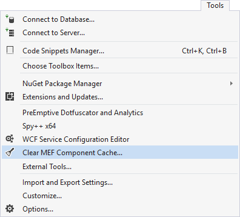
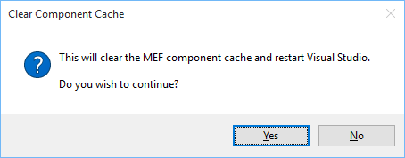

## Clear Component Cache

A Visual Studio extension that clears the MEF (Managed Extensibility Framework) cache.

Download the extension at the
[VS Gallery](https://visualstudiogallery.msdn.microsoft.com/22b94661-70c7-4a93-9ca3-8b6dd45f47cd)
or get the
[nightly build](http://vsixgallery.com/extension/f5028141-9dd0-4ac4-ae6d-0481ae9a940d/)

### What does it do?

This extension clears the MEF cache on disk and lets Visual Studio rebuild it. The
reason for clearing the MEF cache is that it can become corrupted. This ususally
happens when installing or updating extensions or other Visual Studio components.

The Visual Studio component cache is located at
**%localappdata%\Microsoft\VisualStudio\14.0\ComponentModelCache**. This extension
makes it easy to delete that folder so you don't have to remember the location of
the cache directory.

### Using the extension

In Visual Studio's top menu under Tools, a new command is now visible:

Clicking the **Clear MEF Component Cache** button will prompt you to confirm
and then restart Visual Studio.

Restarting Visual Studio will automatically trigger a reconstruction of the
MEF cache. This is a safe operation that doesn't cause any unwanted side effects.
